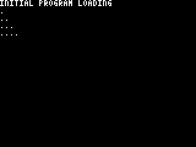
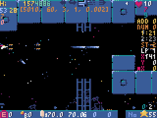
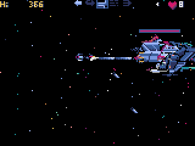
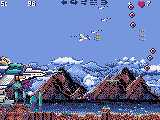

# code-of-python









シューティングゲームっぽい？未完成ですけど・・

## インストール方法
## Windows


最初に[Python3](https://www.python.org/) (バージョン3.6.8以上) をインストールします。

続いて、コマンドプロンプトから、以下の`pip`コマンドでPyxelをインストールします。

```sh
pip install -U pyxel
```
min-sht073.pyとmin-sht2.pyxresとsystem-data.pyxresをダウンロード

コマンドプロンプトから以下の様に入力して実行します

```sh
python min-sht073.py
```
             スペースキーでショットとミサイルの発射
             ゲームパッドのAボタンでショットの発射
             Bボタンでミサイルの発射
             Yボタンでサブウェポンの切り替え
             SELECTボタンで自機移動スピード調整
             LEFTボタンでクロースタイルの変更
             RIGHTボタンでフィックスクローの間隔の調整

TABキーまたはゲームパッドのSTARTで一時停止できます


